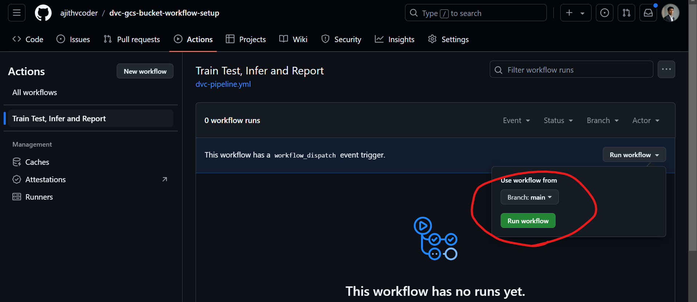

### Using Service Account Method with DVC in GitHub CI/CD Pipeline

**Content**

1. [Setup GCS bucket storage](#setup-gcs-bucket-storage)
2. [Local Setup](#local-setup)
3. [Github Repo setup](#github-repo-setup)
4. [Github Actions](#github-actions)


### Setup GC bucket storage**

In this method, we can store data in a Google Cloud Storage (GCS) bucket and fetch it using service account authentication.

To create a service account, navigate to IAM & Admin in the left sidebar, and select Service Accounts.


Click + CREATE SERVICE ACCOUNT, enter a service account name (e.g., "My DVC Project"). If you are new and don't know what permissions to choose, it's better to give owner permissions.


Add all user accounts for which you need to grant access.


Then click CREATE AND CONTINUE. Click DONE, and you will be returned to the overview page.

Now you can see your service account; click on it and go to the Keys tab.


 
Under Add Key, select Create New Key, choose JSON, and click CREATE.


 
Download the generated projectname-xxxxxx.json key file to a safe location.

#TODO: change to numbers

Important: Store the API key in a local folder as credentials.json, but do not commit it to GitHub. If you do so, GitHub will raise a warning, and Google will be notified, revoking the credentials.

In the Google Console search bar, type "Google Cloud Storage" and go there.

Click the "Create" button -> Give a name to the bucket -> In "Choose where to store data," select "Region" -> "asia-south1" (this can be anything; I just used it as an example) -> Click whatever option is default after this -> Click "Create" at last.


- Click Create a folder and then give it the name "storage" (you can choose any name).


Now you should see a folder similar to the screenshot below:


The URL or location of this is `gs://<bucket_name>/<folder_name>`. For the above folder, it is `gs://dvctestbucket/storage`, where `dvctestbucket` is the bucket name and `storage` is the folder name.


### Local Setup

Hereafter, in your local setup, you need to handle two things: the JSON file (dvcmanager-38xxxxxxx.json or any JSON with projectname-xxx.json which you downloaded as a key) and the Google Storage URL (gs://dvctestbucket/storage).

- Create a folder named data locally.

- Copy the contents from this Kaggle dataset (https://www.kaggle.com/datasets/khushikhushikhushi/dog-breed-image-dataset) into the data folder and unzip it. Remove all files that are not needed (e.g., archive.zip is not needed after unzipping).

|- data
|----dataset
|--------Beagle
|--------Boxer
|--------.
|--------.

- Install dvc and dvc-gs

```pip install dvc dvc-gs```

- Run git init (if you are not in a git folder already)

- Run dvc init

- Now run `dvc remote add -d myremote gs://<mybucket>/<path> command`. Reference [here](https://dvc.org/doc/user-guide/data-management/remote-storage/google-cloud-storage)

eg:  ```dvc remote add -d myremote gs://dvctestbucket/storage````

You will see that "myremote" has been added in the .dvc file.


- Run ```dvc remote modify --local myremote credentialpath devcmanager-385390fe7f4f.json``` i.e ```dvc remote modify --local myremote credentialpath 'path/to/project-XXX.json'```

- Run ```dvc add data```  i.e `dvc add <data_folder_name>

- Run ```dvc config core.autostage true``` (optional)

- Run ```dvc push -r myremote -v```

- Wait for about 10 minutes if it's around 800 MB of data for pushing; if it's in GitHub Actions, wait for 15 minutes.

Now you can check your Google Cloud bucket; you should see a folder named "files" like this:


### Github Repo setup

- Now push this to your GitHub repository. Note that in the .dvc folder, by default, you can only push the "config" and ".gitignore" files. Don't change this; let it remain as is.

- Important: Never push the project-xxx.json file. If you do, Google will identify it and revoke the token; you'll need to set the key again.

- Add only .dvc/config, .gitignore, and data.dvc files.

- After pushing to repo, in github in your repo click on "Secrets and variables" -> "Actions" -> "Repository secret" in your GitHub repo and create a secret named "GDRIVE_CREDENTIALS_DATA" Copy the content of your project-xxx.json file (credentials.json file) into the content field.


- Now push this to github repo

Note in .dvc folder by default u can push only "config" and ".gitingore" file. Dont change it let it be like that.

- Kindly note it dont ever push "project-xxx.json" file. if you push google will identify it and revoke the token you need to set the key again.

- Add `.dvc/config`, `.gitignore`, `data.dvc` files alone.

- Click to "Secrets and variables" -> "Actions" -> "Reprository secret" in github repo and create a secret with name "GDRIVE_CREDENTIALS_DATA" and oopy the content of project-xxx.json file (credentials.json file) in the content.

### Github Actions

- Create a .github/workflows folder locally for setting up your GitHub Actions workflow.

- You can refer to the `dvc-pipeline.yml` file for complete content. 

Below is the code used to set up authentication and pull data inside GitHub CI/CD from Google Cloud Storage bucket:


```
      # Note you can also directly use "GDRIVE_CREDENTIALS_DATA" as env variable and pull it
      - name: Create credentials.json
        env:
          GDRIVE_CREDENTIALS_DATA: ${{ secrets.GDRIVE_CREDENTIALS_DATA }}
        run: |
          echo $GDRIVE_CREDENTIALS_DATA > credentials_1.json

      - name: Modify DVC Remote
        run: |
          dvc remote modify --local myremote credentialpath credentials_1.json

      - name: DVC Pull Data
        run: |
          dvc pull -v
```

- Now you can trigger workflow by clicking "Run workflow" in github actions



**Reference**

- Refered 1st point alone in "Using service account" in https://dvc.org/doc/user-guide/data-management/remote-storage/google-drive#using-service-accounts
- Google cloud storage - https://dvc.org/doc/user-guide/data-management/remote-storage/google-cloud-storage#google-cloud-storage
- Custom authentication google cloud storage - https://dvc.org/doc/user-guide/data-management/remote-storage/google-cloud-storage#custom-authentication

